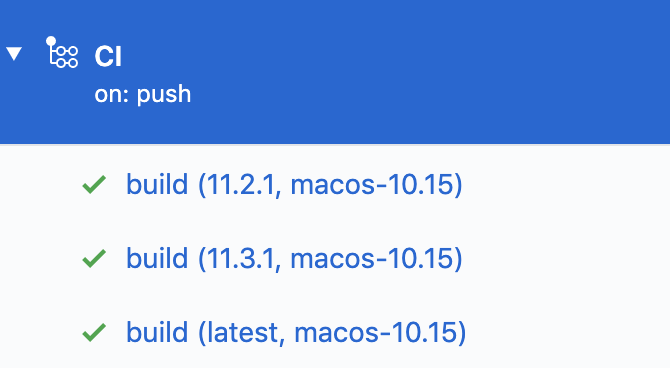

# XCUITestのサンプルコード
XCUITestのサンプルコードです。

|Service|Badge|
|:------|:-----|
|Bitrise（実行先がiOS13系）||
|Bitrise（実行先がiOS12系）||
|GitHub Actions||

## 目的
Xcodeのバージョンによる挙動の違いをすぐに確認できるように用意しています。
複雑なことは一切せず、基本となるAPIの動作確認をおこなっています。

## 実行環境
実行環境としては、「GitHub Actions」と「Bitrise」を利用しています。
それぞれの実行結果はこのREADMEの上記のBadgeを見ればわかります。

実行環境の詳細については「Xcodeのバージョン x 実行する端末のOSバージョン」の観点から次のとおりです。

|CIサービス|Xcodeのバージョン|実行環境|
|:-------|:------|:------|
|GitHub Actions|Xcodeのバージョン3種類（指定２種類、最新１種類）|iOSシミュレーター（そのXcodeの最新）|
|Bitrise|Xcodeのバージョン２種類|iOS実機（Firebase Test Lab）でOSバージョン2種類（最新と１つ前のOSバージョン）|

### GitHub Actions
GitHub Actionsでは３種類のXcodeバージョンでマトリックスビルドをしています。
実行結果は次のような感じです。

指定した２種類のXcodeと、そのVM（macos-latestを指定）に入っている最新のXcodeを指定しています。

### Bitrise
Bitriseでは、２種類のワークフローと２種類のアプリを用意して実行しています。
実行パターンとしては次のとおりです。

|Xcodeのバージョン|実行環境|
|:-------|:------|
|Xcode10.3     |iOS12系|
|Xcode11.4     |iOS12系|
|Xcode10.3     |iOS13系|
|Xcode11.4     |iOS13系|

 

