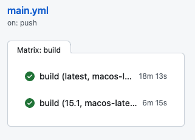

# XCUITestのサンプルコード
XCUITestのサンプルコードです。

|Service|Badge|
|:------|:-----|
|Bitrise||
|GitHub Actions||

## 目的
Xcodeのバージョンによる挙動の違いをすぐに確認できるように用意しています。

## 実行環境
環境としては「GitHub Actions」を使って複数のXcodeバージョンでマトリックスビルドをしています。
実行結果は次のような感じです。

また他に「Bitrise」も併せて利用しています。
それぞれの実行結果はこのREADMEの上記のBadgeを見ればわかります。

実行環境の詳細については次のとおりです。

|CIサービス|Xcodeのバージョン|実行環境|
|:-------|:------|:------|
|GitHub Actions|Xcodeのバージョン3種類|iOSシミュレーター（そのXcodeの最新）|
|Bitrise|-|-|

